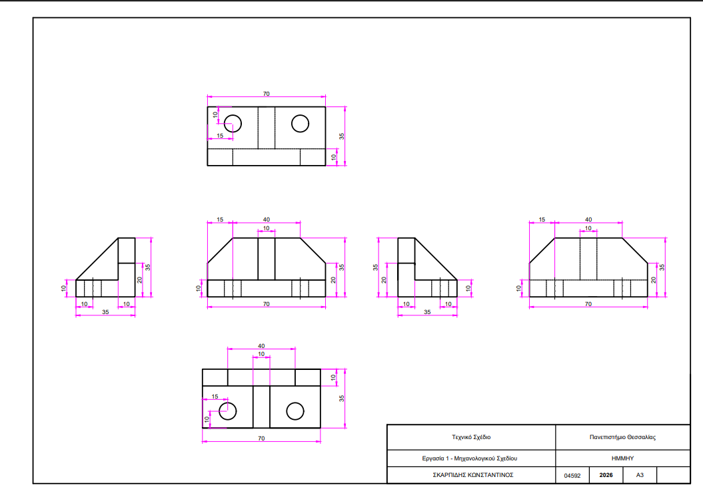
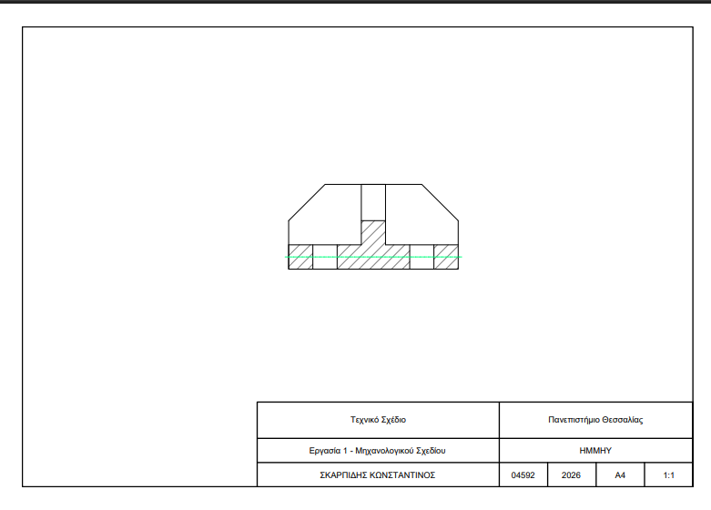
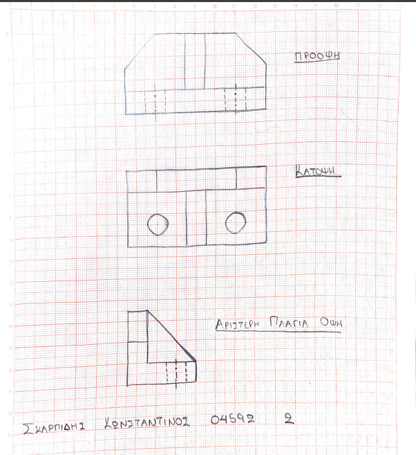
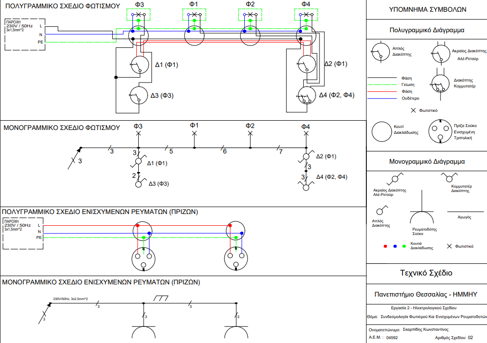
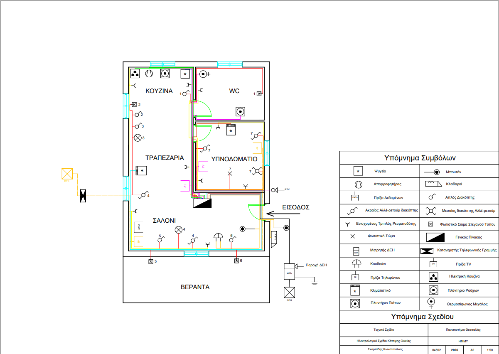
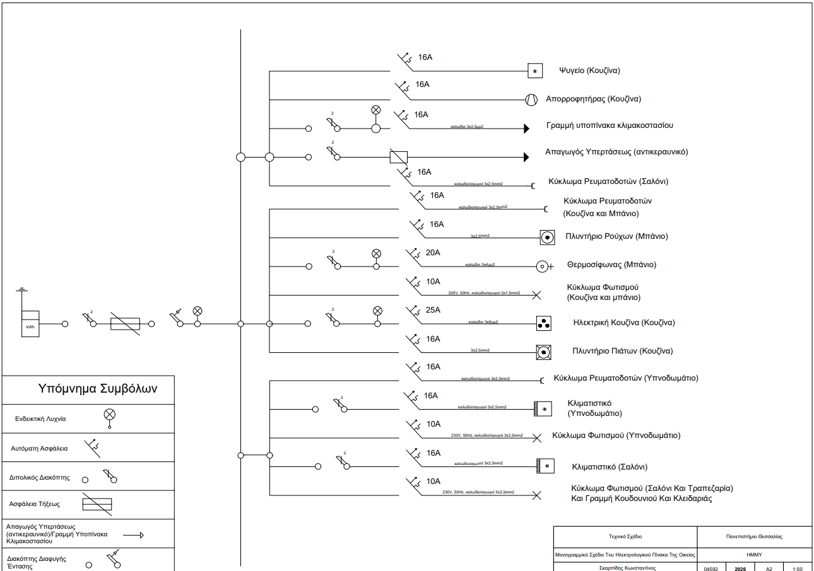

# Engineering Portfolio

Welcome to my Engineering Portfolio! This repository contains a collection of my technical drawings and design projects, showcasing my skills in Computer-Aided Design (CAD) and engineering principles.

## 🛠️ Tools & Technologies
* **Software:** AutoCAD (2D/3D)
* **Skills:** Technical Drawing, Floor Plans, Mechanical Parts.

## 📂 Repository Structure

Below is an overview of the projects included in this repository:

### Autocad Projects
A series of technical drawing exercises and assignments:
* **Tests:** Test 1 (Basic 2D commands), Test 2 (Design of Electrical Symbol Legend), Test 3 (power circuit and control (automation) circuit for starting two three-phase asynchronous motors)
* **Assignments:** 

**Assignment 1:** Freehand sketch of the three principal views, fully dimensioned views, and a full section of a mechanical component.

**Assignment 2:** Lighting & Power Sockets Wiring Diagrams. Design of standard electrical wiring connections. It includes the development of multi-line and single-line diagrams for lighting and socket (Schuko) circuits, accompanied by the respective symbol legends!

**Assignment 3:** Complete interior electrical installation shown on the architectural floor plan of a single-story residence, featuring symbols for lighting, power outlets, appliance connections, and low-voltage systems. Also included is the single-line diagram of the main electrical distribution board.

*(Note: Each folder contains the respective `.dwg` files and `.pdf` exports of the models/layouts).*

## 📬 Contact
Feel free to reach out to me for collaboration or job opportunities!
* **LinkedIn:** [Konstantinos Skarpidis](https://www.linkedin.com/in/%CE%BA%CF%89%CE%BD%CF%83%CF%84%CE%B1%CE%BD%CF%84%CE%AF%CE%BD%CE%BF%CF%82-%CF%83%CE%BA%CE%B1%CF%81%CF%80%CE%AF%CE%B4%CE%B7%CF%82-91b36a23b/)
* **Email:** [kostas.skrp@gmail.com]
